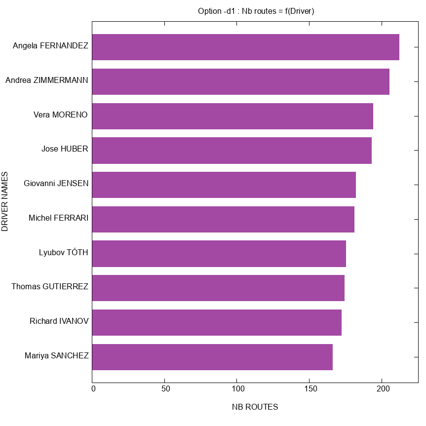
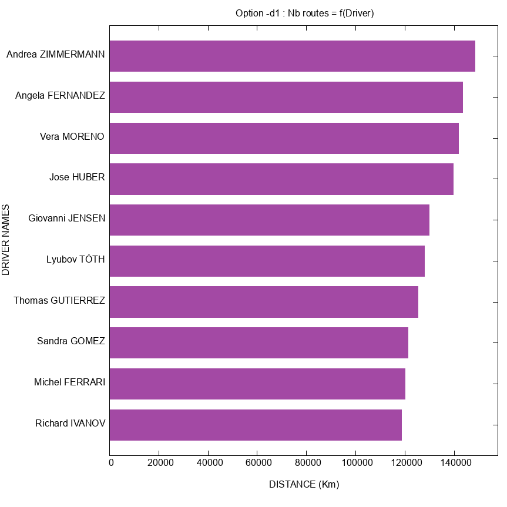
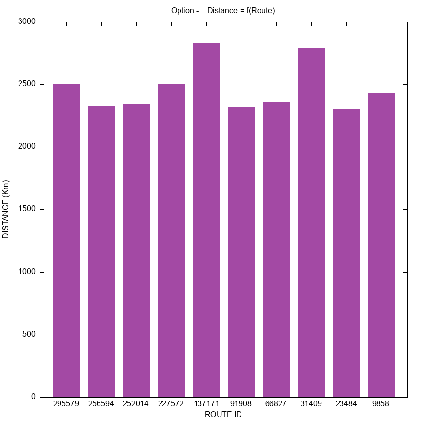
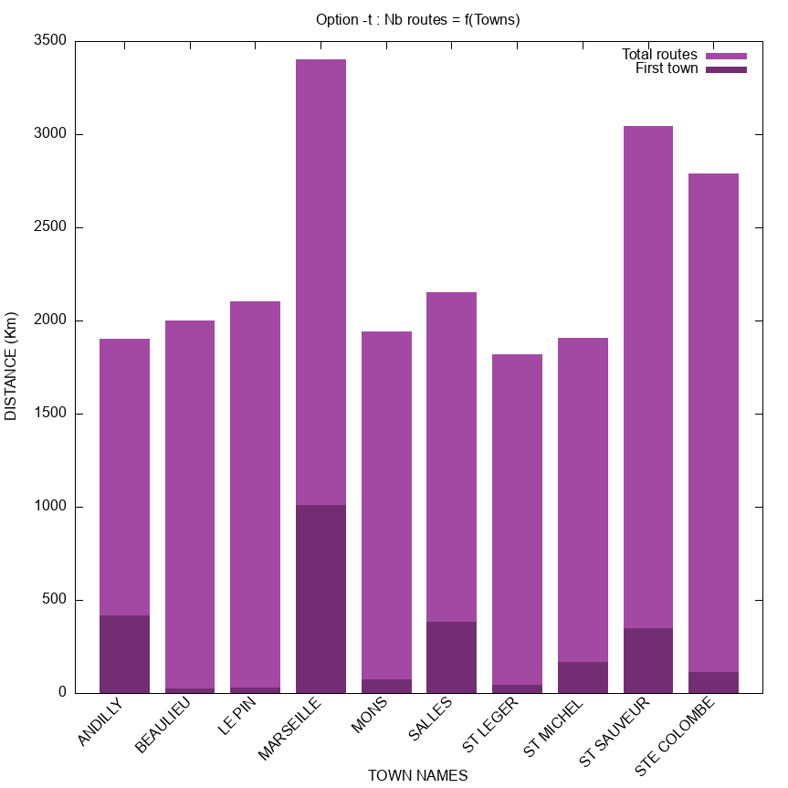
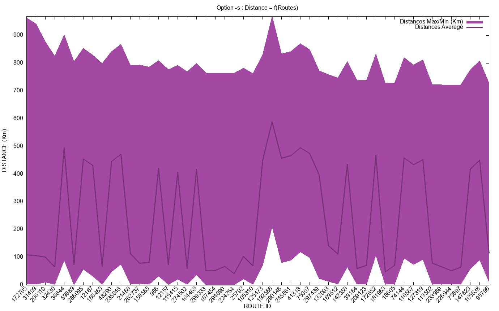

# Projet-Info-S3
A small project based on an assignment, see [Assignment.pdf](Assignment.pdf).

The goal of the assignment is to study data from a trucking company. A database of every Routes taken by a driver as well as every individual step of this route, from one town to another, is provided to us. However, it is completely unsorted, and it is up to us to process it to extract useful information from it. Of course, once we're done, we need to display this information to the user, which we do using [GNU Plot](http://www.gnuplot.info/).

The format of the database is a simple CSV file, formatted as such :

| Route ID | Step ID | Town A | Town B | Distance | Driver |
| -- | -- | -- | -- | -- | -- |
|123507|2|BEYCHAC ET CAILLAU|LATRESNE|13.617|Laura NAVARRO
107421|6|MARIGNIER|FAUCIGNY|9.953|Eva WEBER
39435|18|ECLANCE|ROLAMPONT|63.44|Evgeniy SMITH
42199|18|CAUBON ST SAUVEUR|VAUSSEROUX|219.856|Tatiana RODRIGUEZ
116783|2|GIRAUVOISIN|BITSCHWILLER LES THANN|152.254|Anna KUZNETSOVA

_example from the first few lines of the CSV file provided to us as the file that our project must be able to process_

# Syntax :

```bash main.sh DATA_LOCATION ARG```

where ``DATA_LOCATION`` is the path to your CSV file (will be copied under data/data.csv) and ``ARG`` is either ``-d1``, ``-d2``, ``-l``, ``-s`` or ``-t``. See ``-h`` or ``man ./help`` for more information.


# Expected output :

```
[fleefie@providence Projet-Info-S3]$ bash main.sh data.csv -d1
Compiled C code
Starting D1 process..
Program ran in 3.518 seconds.
[fleefie@providence Projet-Info-S3]$ bash main.sh data.csv -d2
Compiled C code
Starting D2 process..
Program ran in 3.906 seconds.
[fleefie@providence Projet-Info-S3]$ bash main.sh data.csv -l
Compiled C code
Starting L process..
Program ran in 5.196 seconds.
[fleefie@providence Projet-Info-S3]$ bash main.sh data.csv -s
Compiled C code
Starting S process..
Program ran in 4.859 seconds.
[fleefie@providence Projet-Info-S3]$ bash main.sh data.csv -t
Compiled C code
Starting T process..
Expect this one to take a while !
Program ran in 17.757 seconds.
``````

### Expected plots available in Demo/

# D1 Process :
## Top 10 numbers of routes per driver, sorted by routes in descending order
### Tools used : Common Shell scripting utils, gAWK, SEd, ImageMagick OR FFMPEG (see Dependencies) 


# D2 Process :
## Top 10 distances per driver, sorted by distances in descending order
### Tools used : Common Shell scripting utils, gAWK, SEd, ImageMagick OR FFMPEG (See Dependencies)


# L Process :
## Top 10 route distances, sorted by route ID in descending order
### Tools used : Common Shell scripting utils, gAWK, SEd


# T Process :
## Top 10 towns by number of routes passing by them, sorted by alphabetical order, in descending order.
### Tools used : C code, see [progc/](progc/)


# S Process :
## Graph of the top 50 of routes by the largest and smallest distance of their steps, as well as the average distance of a route's step. Sorted by the difference between the largest and smallest steps of a route, in descending order.
### Tools used : C code, see [progc/](progc/)


# Dependencies :

This project depends on BASh, Make, the GNU standard library, and either ImageMagick or FFMPEG. Both of the latter are installed in common Linux distributions, but as a failsafe, if they aren't found, the resulting images of ``-d1`` and ``-d2`` will simply not be rotated. This is done using BASh's ``hash`` command, so no need to worry about needing to fix the code yourself if you somehow don't have either of those dependencies.

# Credits :

See : [GNUPlot scripts README](gnuplot/README.md). While not mentioned in the main.sh file, [GNU.org](https://www.gnu.org/software/sed/manual/html_node/Regular-Expressions.html) for the help with SEd regex. As linked in the comments of [main.sh](main.sh), the GNU online software manual also helped us greatly with the use of gAWK. ImageMagick's ``convert`` command as well as the filters from ``FFMPEG`` were both implemented as means to rotate our plot's images, so credit is due where it is due.

# Known bugs :

So far, no bugs were found in our current code.

# Possible enhancements :

- Ask the user how many data points they would like to output in their plots. This would require advanced scripting, and while it feels like it could be a part of the scope of this project, our code uses too many crutches that depend on the data generation being relatively simple.
- Replacing most instances of sorting through arrays by balanced BSTs that allow duplicate values. Our BSTs not working with dupes is why we had to use arrays for some sorts and why we needed to do a sub-BST for every node of a BST in the T process, leading to it being as long as it is. This enhancement would allow us to greatly increase the scope of this project, such as permitting the implementation of the above feature.